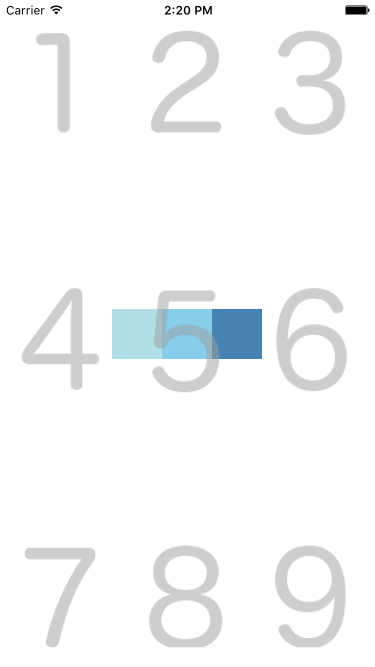
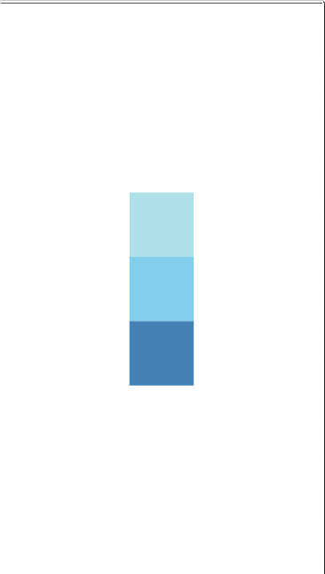

# react-native-col

A wrapper around the [`react-native`](https://github.com/facebook/react-native) `<View/>` component enabling concise assignment of flexbox layout properties.

The idea is to keep JSX as clean as possible, while removing the need to manage stylesheet declarations for common positioning needs.

## Installation

```
$ yarn add react-native-col
```

## Basic Usage

```js
// Before
<View style={{ flexDirection: "row", justifyContent: "flex-end", alignItems: "flex-start", flex: true }} />

// After
<Row3 />
```

## Documentation

### The `dial` property

Every component exposed, includes a `dial` "property" in its name: `Col5`, `Row4`, etc...

The idea behind the dial notation, is to position the child components of `Row`/`Col` according to the position of the `dial` number on a phone dial pad.

```js
<Row5>
	<View style={styles.squareBlueLighter} />
	<View style={styles.squareBlueLight} />
	<View style={styles.squareBlue} />
</Row5>
```



```js
<Col5 />
```



### `Col`

`Col<dial>` is equivalent to a react-native `View` with Y main axis and `flex: true`.

```js
import { Col3 } from 'react-native-col';

<Col3 />
<View style={{ flexDirection: "column", justifyContent: "flex-start", alignItems: "flex-end", flex: true }} />
```

_NB_: All styles are generated and _not_ passed inline.

### `Row`

`Row<dial>` is equivalent to a react-native `View` with X main axis and `flex: true`.

```js
import { Row6 } from 'react-native-col';

<Row6 />
<View style={{ flexDirection: "row", justifyContent: "flex-end", alignItems: "center", flex: true }} />
```

## Credits

_ALL_ credit goes to the [`react-native-row`](https://github.com/hyrwork/react-native-row) library.

The main difference with [`react-native-row`](https://github.com/hyrwork/react-native-row) is the separation of the margin/padding properties into a much more powerful standalone library `react-native-spacesheet`:

https://github.com/eightyfive/react-native-spacesheet

So `react-native-col` is just a cleaner / more focused version (dial only) of [`react-native-row`](https://github.com/hyrwork/react-native-row).
