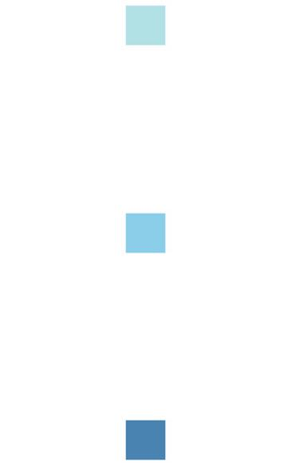
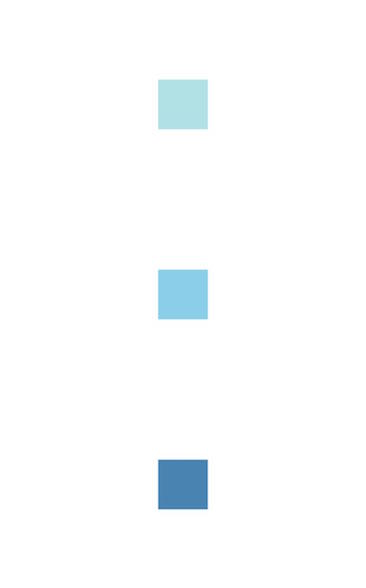

# react-native-col

A wrapper around the [`react-native`](https://github.com/facebook/react-native) `<View/>` component enabling concise assignment of flexbox layout properties.

The idea is to keep JSX as clean as possible, while removing the need to manage stylesheet declarations for common positioning needs.

## Installation

```
$ yarn add react-native-col
```

## Basic Usage

```js
// Before
<View style={{ flexDirection: "row", justifyContent: "flex-end", alignItems: "flex-start" }} />

// After
<Row dial={3} />
```

## Documentation

### `Col` (`View`) & `Row` components

Import the `View` component of this package as `Col` for explicitness versus `Row` component:

```js
import Col, { Row } from "react-native-col";

```


### `dial` property

The idea behind the dial notation, is to position the child components of `Row`/`Col` according to the position of the `dial` number on a phone dial pad.

```js
<Row dial={5} flex>
  <View style={styles.squareBlueLighter} />
  <View style={styles.squareBlueLight} />
  <View style={styles.squareBlue} />
</Row>
```


```js
<Col dial={5} flex />
```


### `space` property

You can also use the `space` property to override `justifyContent`:


```js
<Col dial={5} space="between" flex />
```



```js
<Col dial={5} space="around" flex />
```



### `stretch` property

Use the `stretch` property to override `alignItems`:

```js
<Col dial={5} stretch flex />
```

### `flex` property

```js
<Row flex /> // flex = 1 by default
<Row flex={3} />
```

### `reverse` property

Use reverse to change `flexDirection` from `row` to `row-reverse` or from `column` to `column-reverse`:

```js
<Row reverse />
<Col reverse />
```
